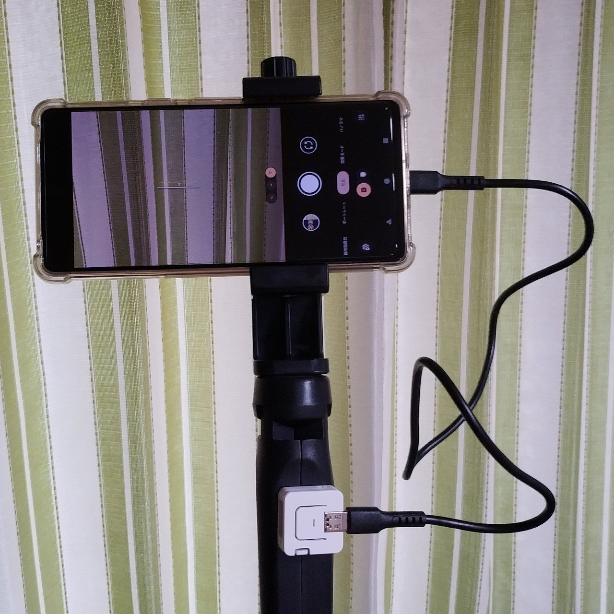

# AtomS3 Cable Release for Android

This project makes AtomS3 a cable release for Android.

## Usage

1. Connect AtomS3 to Android with USB cable.
2. Open camera app
3. Push the button on AtomS3 to release

## Supported Hardware

* [M5Stack AtomS3](https://docs.m5stack.com/en/core/AtomS3)

## Build Environment

* PlatformIO

## Dependencies

* m5stack/M5AtomS3 @ ^1.0.0
* m5stack/M5Unified @ ^0.1.16
* fastled/FastLED @ ^3.7.0
